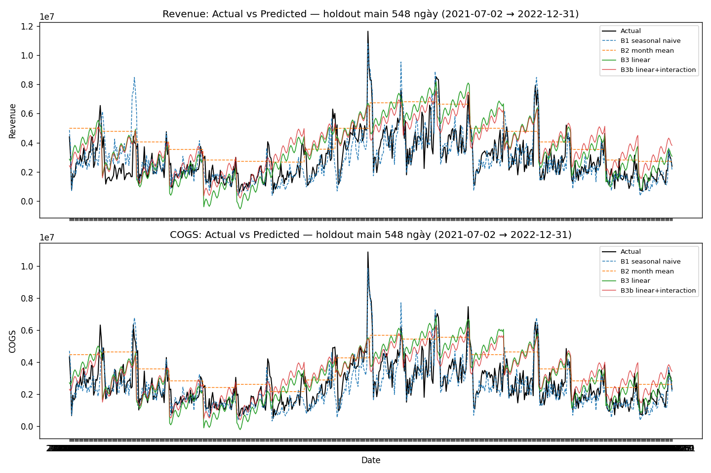
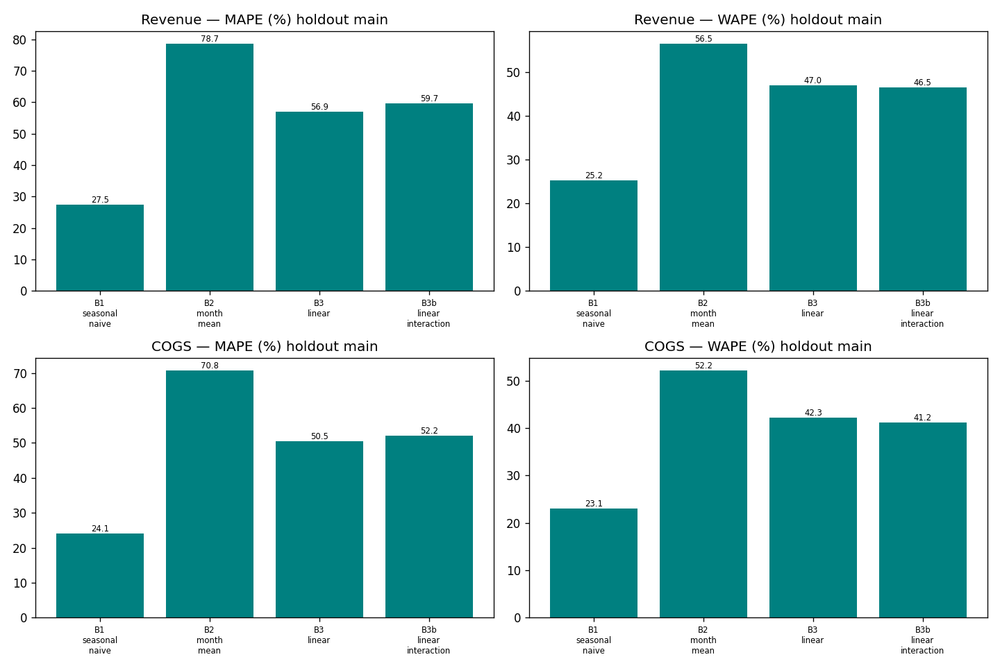
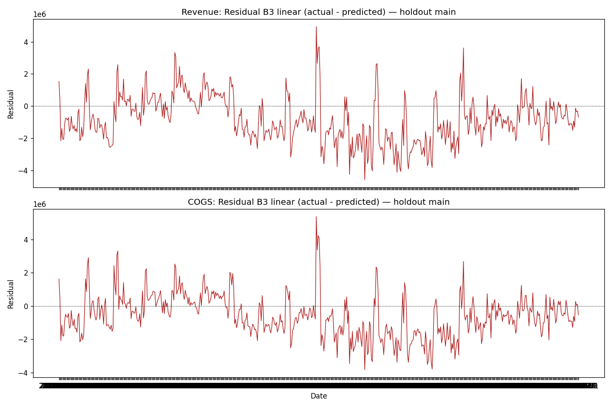
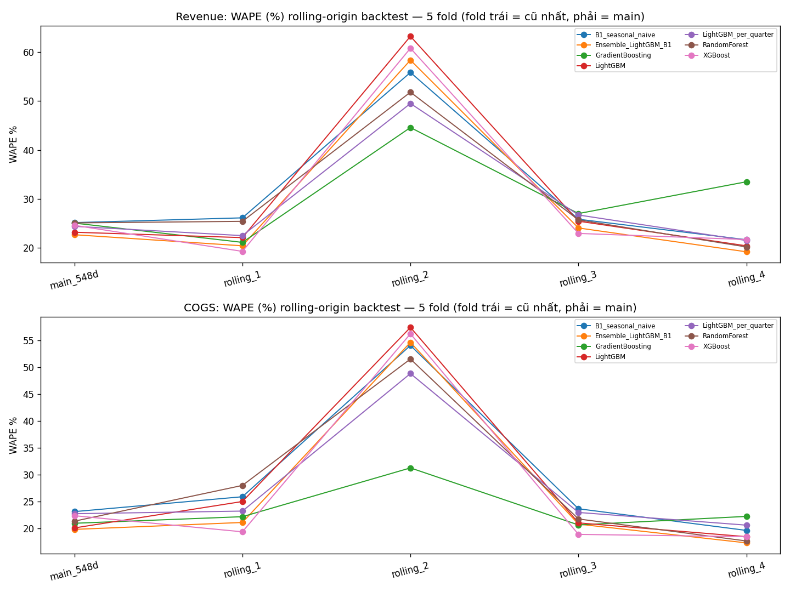
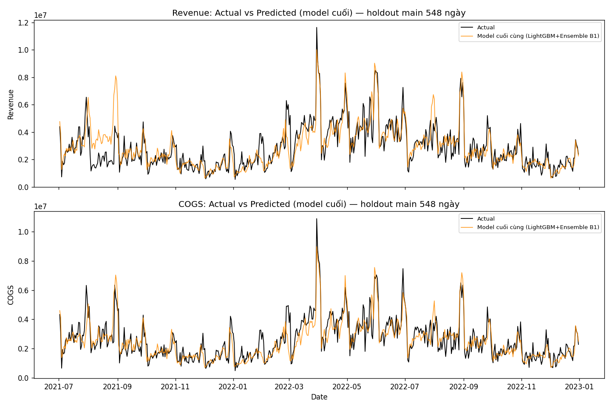
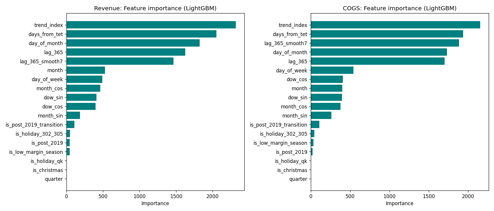
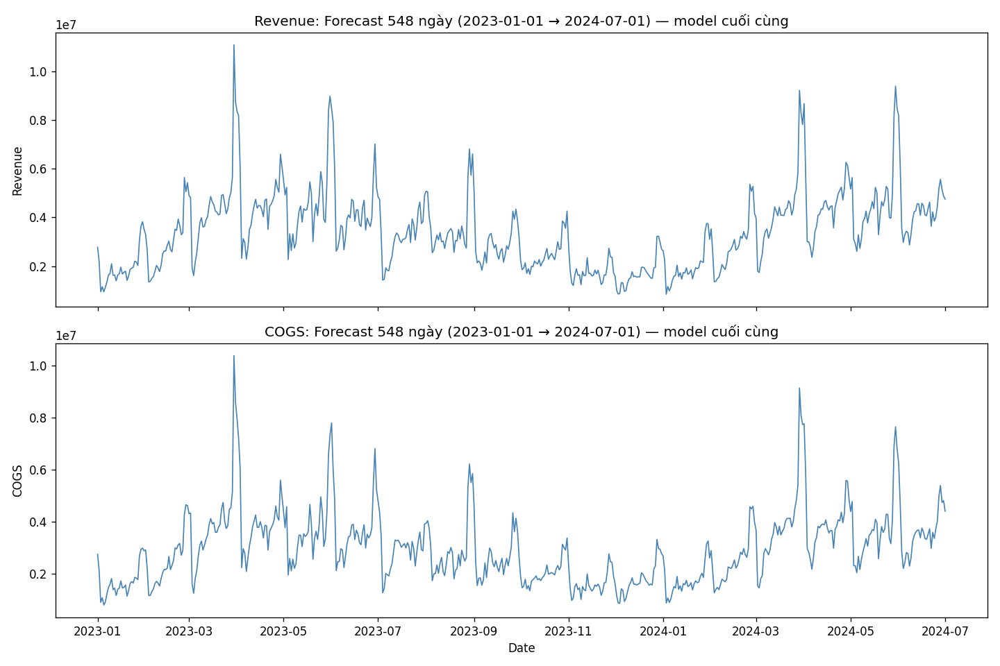
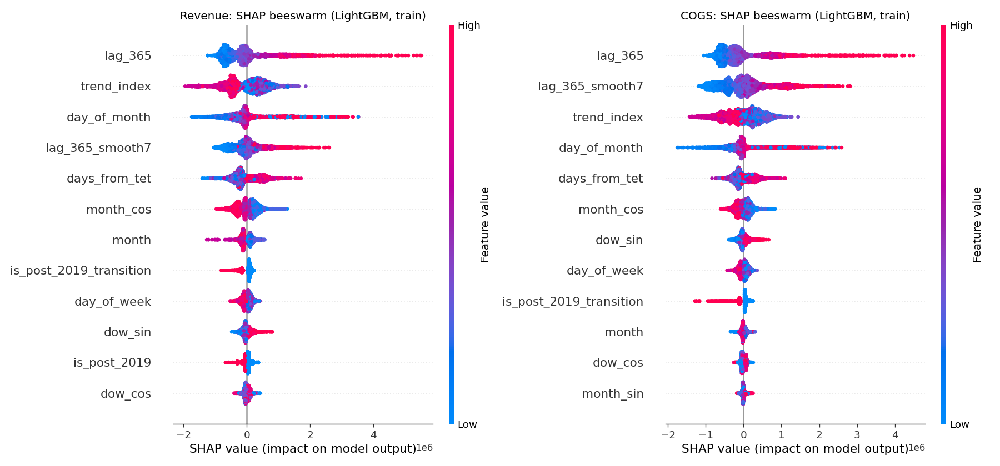
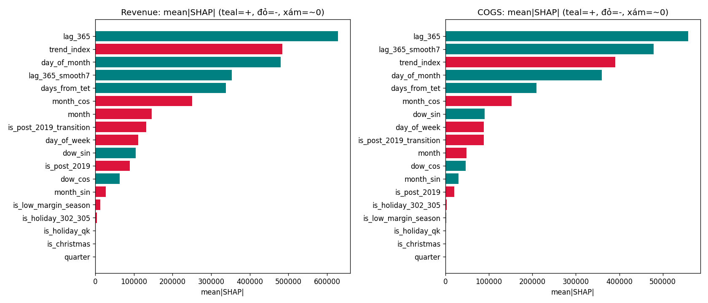

# Phần B — Câu chuyện Dự báo: Model → Validation → Rủi ro

- **Vai trò:** DS (T10.2), kể câu chuyện Phần B cho báo cáo thi Datathon 2026.
- **Phạm vi:** đây là bài **tổng hợp**, không chạy phân tích/model mới. Toàn bộ số liệu lấy nguyên văn từ `PROGRESS.md`, `phase7_baseline/baseline_report.md`, `phase8_model/model_report.md`, `phase9_validation/validation_report.md` và chart `output/phase7-9`. Số nào chưa có trong 4 nguồn này thì không đưa vào.
- **Bài toán:** dự báo **Revenue** và **COGS** hằng ngày cho 548 ngày tương lai (2023-01-01 → 2024-07-01), chưa có ground-truth thật tại thời điểm làm model.

---

## Tóm tắt nhanh (đọc trước khi vào chi tiết)

1. **Feature chỉ dùng lịch** (ngày tháng, mùa vụ, Tết) — vì Phần A phát hiện dữ liệu khách hàng không có hành vi quay lại thật, mọi feature kiểu "khách cũ quay lại" đều vô nghĩa.
2. **Bất ngờ ở bước baseline:** model "ngây thơ" nhất — lấy nguyên giá trị cùng ngày năm ngoái — lại thắng áp đảo 1 model hồi quy tuyến tính có đầy đủ feature. Bài học này quyết định hướng đi của cả Phần B.
3. **Model cuối** = LightGBM + trung bình với chính baseline "ngây thơ" đó, cộng thêm 1 feature mới (giá trị năm ngoái). Kết quả **vượt mốc** trên cả 2 chỉ tiêu: **Revenue WAPE 22.71%** (mốc phải vượt 25.18%), **COGS WAPE 19.79%** (mốc phải vượt 23.09%).
4. **Kiểm định độc lập (không phải người xây model tự chấm):** số tính lại khớp, không rò rỉ dữ liệu tương lai, file nộp tái lập được y hệt qua nhiều lần chạy.
5. **3 rủi ro thật, không giấu:** (a) model có thể đánh giá thấp nếu doanh thu 2023-2024 tăng vượt mọi năm trong lịch sử; (b) chưa có số thật của 2023-2024 để đối chiếu; (c) nếu có biến cố sốc kiểu năm 2019, mọi model — kể cả model này — đều sẽ sai nhiều.

---

## 0. Bài toán & sợi dây nối từ Phần A

### 0.1 Vì sao chỉ dùng feature thuần lịch

Phần A (Giai đoạn 3 — Dashboard, Giai đoạn 5 — chốt giả định) phát hiện: **retention theo cohort gần như phẳng tuyệt đối** — tháng 1 sau khi mua và tháng 12 sau khi mua, tỷ lệ khách quay lại gần như bằng nhau (~3–6%, độ lệch chuẩn chỉ 0.4 điểm %). Một khách hàng thật thường quay lại nhiều hơn ở giai đoạn đầu rồi giảm dần — đường cong phẳng như vậy là dấu hiệu mạnh cho thấy **dữ liệu khách hàng được sinh ra ngẫu nhiên độc lập theo thời gian**, không mô phỏng hành vi quay lại thật.

Hệ quả trực tiếp cho Phần B: **mọi feature dựa trên "khách quay lại"** — CLV, số khách hoạt động lăn theo tháng, tần suất mua lặp lại... — **không mang thông tin dự báo thật**, dù tính ra vẫn "chạy được" về mặt kỹ thuật. Vì vậy Giai đoạn 6 (feature engineering) và cả Phần B chỉ dùng **feature thuần lịch**: vị trí trong tháng/tuần/quý, khoảng cách tới Tết, cờ giai đoạn trước/sau đợt gãy cấu trúc 2019, chỉ số xu hướng theo thời gian — tổng cộng 17 feature lịch, sàng lọc tương quan cho thấy `month_cos` (−0.50), `is_post_2019` (−0.38), `days_from_tet` (+0.37) là 3 tín hiệu mạnh nhất; `quarter` bị loại vì trùng lặp gần như hoàn toàn với `month` (tương quan 0.97).

### 0.2 Vì sao target = gross demand (không phải doanh thu ròng)

Trước khi build feature, Giai đoạn 5 đã xác nhận độc lập: cột target khớp **MAPE 0.000%** với tổng hợp trực tiếp từ `sales.csv` gộp cả đơn hàng bị huỷ (gross demand) — trong khi đối chiếu với phương án doanh thu ròng (loại đơn huỷ) lệch tới **13.9%**. Nói cách khác: đề bài yêu cầu dự báo *tổng nhu cầu phát sinh* (kể cả phần sau này bị huỷ), không phải doanh thu thực thu. Chốt target đúng ngay từ đầu để tránh việc cả Phần B build nhầm mục tiêu.

**Ràng buộc giữ nguyên xuyên suốt:** Revenue và COGS được huấn luyện **độc lập** — không dùng target này để suy ra target kia, không ép COGS phải nhỏ hơn Revenue bằng công thức cứng.

---

## 1. Data & thiết kế đánh giá (train/validation theo thời gian)

Vì đây là dữ liệu chuỗi thời gian, mọi việc chia tập đều tôn trọng thứ tự thời gian — **không bao giờ dùng dữ liệu tương lai để dự đoán quá khứ**.

| Tập | Khoảng thời gian | Số ngày | Vai trò |
|---|---|---:|---|
| `train_fit` (fold chính) | 2012-07-04 → 2021-07-01 | 3.285 | Fit model, không được nhìn thấy holdout |
| **Holdout chính (`main_548d`)** | 2021-07-02 → 2022-12-31 | 548 | Mốc đánh giá chính thức — đúng độ dài + độ mới của horizon thật |
| `train_full` (production) | 2012-07-04 → 2022-12-31 | 3.833 | Dùng để fit model cuối cùng, tạo forecast thật |
| **Forecast thật (bản nộp)** | 2023-01-01 → 2024-07-01 | 548 | Chưa có ground-truth |

Từ Giai đoạn 8, đánh giá được nâng lên **rolling-origin backtest, 5 fold** (thay vì chỉ 1 lần chia) để kiểm tra độ ổn định qua nhiều giai đoạn lịch sử khác nhau:

| Fold | Holdout | Train_fit kết thúc | Ghi chú |
|---|---|---|---|
| `main_548d` | 2021-07-02 → 2022-12-31 | 2021-07-01 | **Fold chính thức** — tiêu chí chọn model |
| `rolling_1` | 2020-01-01 → 2021-07-01 | 2019-12-31 | Kiểm tra ổn định |
| `rolling_2` | 2018-07-02 → 2019-12-31 | 2018-07-01 | Trùng đúng giai đoạn gãy cấu trúc 2019 — khó nhất |
| `rolling_3` | 2016-12-31 → 2018-07-01 | 2016-12-30 | Kiểm tra ổn định |
| `rolling_4` | 2015-07-02 → 2016-12-30 | 2015-07-01 | Train_fit ngắn nhất còn đủ dữ liệu |

Model được **chọn theo WAPE của fold `main_548d`** (đúng mốc đề bài yêu cầu); 4 fold `rolling_*` dùng để đánh giá độ ổn định, không dùng để chọn model — vì `rolling_2` rơi đúng vào giai đoạn sốc 2019, không đại diện tốt cho horizon thật 2023-2024 (gần `main_548d` hơn nhiều).

**Lưu ý quan trọng xuyên suốt cả Phần B:** vì horizon thật (2023-2024) chưa có ground-truth, **mọi con số WAPE/MAPE trong toàn bộ tài liệu này đến từ holdout nội bộ (2012-2022)**, không phải đánh giá trên dữ liệu thật của horizon dự báo.

---

## 2. Bước 1 — Baseline: bất ngờ seasonal naive thắng

Giai đoạn 7 dựng 4 baseline độc lập cho Revenue và COGS:

| Tên | Cách làm |
|---|---|
| **B1 — Seasonal naive** | Lấy nguyên giá trị đúng ngày này năm trước (fallback ±3 ngày, cuối cùng mới lấy trung bình lịch sử) |
| B2 — Month-mean | Trung bình target theo tháng, tính trên tập fit |
| B3 — Linear (OLS) | Hồi quy tuyến tính trên 9 feature lịch đã sàng lọc |
| B3b — Linear + interaction | B3 + 2 tương tác `is_post_2019 × mùa vụ` |

**Kết quả holdout chính (548 ngày, WAPE — chỉ số chính dùng để so sánh):**

| Baseline | Revenue WAPE | COGS WAPE |
|---|---:|---:|
| **B1 seasonal naive** | **25.18%** | **23.09%** |
| B3b linear + interaction | 46.54% | 41.22% |
| B3 linear | 46.97% | 42.28% |
| B2 month-mean | 56.51% | 52.22% |

Model "ngây thơ" nhất — chỉ copy giá trị năm ngoái — **thắng áp đảo** cả model hồi quy có đầy đủ feature lịch, khoảng cách gần gấp đôi (WAPE ~25% so với ~47%). Đây không phải lỗi tính toán (đã kiểm tra lại bias riêng).

**Vì sao B3 (linear) thua đậm — đã tìm ra nguyên nhân cụ thể:** biến xu hướng thời gian (`trend_index`) trong model tuyến tính chỉ có **1 hệ số duy nhất** cho toàn bộ 2013-2022, trong khi thực tế doanh thu **tăng mạnh 2013-2018 rồi giảm/phục hồi chậm sau 2019**. Một đường thẳng không thể vừa khớp cả 2 pha trái chiều nhau — khi ngoại suy sang giai đoạn gần đây, nó vẫn cộng thêm độ dốc dương của thời tăng trưởng cũ, gây lệch dự đoán cao hơn thực tế **một cách hệ thống**: doanh thu thật trung bình ở holdout chính là 2.875.239, model B3 dự đoán 3.712.559 (lệch +29%); riêng năm 2022, thật 3.204.791 nhưng model dự đoán 4.461.063 (lệch +39%). Nặng hơn nữa, B3 còn cho **4 ngày Revenue dự báo âm** (thấp nhất −231.484, ngày 2023-12-02) — vì hồi quy tuyến tính không có cơ chế chặn giá trị ở 0, mà doanh thu âm là vô nghĩa về mặt vật lý.

*B1 (nét đứt) bám sát biến động thật kể cả đỉnh nhọn đột biến; B3/B3b nằm cao hơn actual rõ rệt suốt nửa sau giai đoạn — đúng bằng chứng bias hệ thống.*

*Thứ tự nhất quán ở mọi chỉ số: B1 thấp nhất → B3b ≈ B3 → B2 cao nhất.*

*Phần lớn điểm residual nằm dưới 0 (actual < predicted) — không phải nhiễu ngẫu nhiên, mà là dấu hiệu model chưa đủ khớp cấu trúc gãy 2019.*

**Quyết định chốt hướng cho Giai đoạn 8:** vì B1 thắng nhờ nắm được "mức nền mùa vụ năm trước" mà không hề ngoại suy tuyến tính, hướng đi đúng không phải là bỏ B1 mà là **giữ lại tín hiệu lag mùa vụ, cộng thêm khả năng học phi tuyến của model cây** (tree-based không ngoại suy 1 đường thẳng xuyên suốt break như linear). Cụ thể: (1) thử model dạng cây (Random Forest/Gradient Boosting/LightGBM/XGBoost) thay cho linear; (2) đưa "giá trị cùng kỳ năm trước" vào thẳng làm **feature** (`lag_365`) thay vì chỉ dùng như 1 baseline riêng lẻ; (3) bắt buộc chặn giá trị dự báo ở 0.

**Mốc chính thức Giai đoạn 8 phải vượt qua (WAPE, holdout chính):**

| | Revenue | COGS |
|---|---:|---:|
| Mốc B1 phải vượt | **25.18%** | **23.09%** |

---

## 3. Bước 2 — Model cuối: LightGBM + Ensemble, vượt mốc

### 3.1 Feature

Giữ nguyên toàn bộ feature lịch thuần của Giai đoạn 6 (`month`, `quarter`, `day_of_week`, `day_of_month`, mã hoá cyclical sin/cos, `is_post_2019`, `days_from_tet`, `is_low_margin_season`, `trend_index`, 3 cờ lễ Việt Nam...), cộng thêm 2 feature mới đúng theo bài học từ bước baseline:

- `lag_365`: giá trị thật (hoặc giá trị model tự dự đoán, nếu vượt quá 365 ngày horizon) tại đúng ngày cùng kỳ năm trước — logic giống hệt B1, nhưng giờ là 1 input cho model học cùng các feature khác.
- `lag_365_smooth7`: trung bình 7 ngày quanh mốc đó, làm mượt nhiễu ngày lẻ.

**Cơ chế dự báo tuần tự (cần hiểu để đọc đúng rủi ro ở mục 6):** horizon 548 ngày dài hơn 365 ngày lag, nên 365 ngày đầu forecast dùng `lag_365` từ **giá trị thật**, nhưng khoảng 183 ngày cuối (nửa đầu 2024) phải dùng `lag_365` từ **giá trị model tự dự đoán trước đó** (chain) — không phải rò rỉ dữ liệu, nhưng có rủi ro lý thuyết là sai số cộng dồn.

### 3.2 Model — đã thử những gì

Test trên rolling-origin, cả 2 target: RandomForest, GradientBoosting, XGBoost, LightGBM (đều dạng cây), sau đó thử thêm 2 biến thể trên model cây thắng nhất: ensemble với B1, và huấn luyện riêng theo từng quý.

**WAPE % trên fold `main_548d` (tiêu chí chọn chính thức):**

| Model | Revenue | COGS |
|---|---:|---:|
| B1 seasonal naive (mốc GĐ7) | 25.18 | 23.09 |
| RandomForest | 25.13 | 21.31 |
| GradientBoosting | 25.09 | 20.92 |
| XGBoost | 24.63 | 22.34 |
| **LightGBM** | **23.22** | **20.05** |
| LightGBM huấn luyện riêng theo quý | 24.42 | 22.70 |
| **Ensemble (LightGBM + B1, trung bình 50/50)** | **22.71** | **19.79** |

**LightGBM thắng trong nhóm model đơn** (thấp nhất cả 2 target). Thử huấn luyện riêng theo từng quý để "chuyên biệt hoá" **lại tệ hơn** model chung (Revenue 24.42% vs 23.22%, COGS 22.70% vs 20.05%) — mỗi model quý chỉ còn ~950 ngày dữ liệu thay vì ~3.285 ngày, mất dữ liệu do chia nhỏ không được bù lại. Bằng chứng thêm: feature `quarter` trong model chung có **importance gần như 0** — mùa vụ theo quý đã được `month`/`month_sin`/`month_cos` bắt trọn, chia theo quý là dư thừa.

**Ensemble (LightGBM trung bình 50/50 với B1) thắng cuối cùng** — cải thiện thêm so với LightGBM đơn (Revenue 23.22%→22.71%, COGS 20.05%→19.79%).

**Cấu hình cuối cùng — giống nhau cho cả 2 target:** LightGBM (global, không chia quý) + Ensemble 50/50 với B1 seasonal naive, fit sản xuất trên toàn bộ 2012-2022.

### 3.3 Kết quả so với mốc (bảng chính)

| Target | Metric | Mốc B1 (GĐ7) | Model cuối (GĐ8) | Cải thiện |
|---|---|---:|---:|---:|
| Revenue | **WAPE** | 25.18% | **22.71%** | −2.47 điểm % (−9.8% tương đối) |
| Revenue | MAPE | 27.48% | 26.19% | −1.29 điểm % |
| Revenue | RMSE | 1.022.856 | 945.528 | thấp hơn |
| Revenue | MAE | 724.009 | 653.010 | thấp hơn |
| COGS | **WAPE** | 23.09% | **19.79%** | −3.30 điểm % (−14.3% tương đối) |
| COGS | MAPE | 24.08% | 21.30% | −2.78 điểm % |
| COGS | RMSE | 830.134 | 726.071 | thấp hơn |
| COGS | MAE | 601.980 | 515.752 | thấp hơn |

→ **Vượt mốc rõ ràng cả 2 target**, trên đúng chỉ số chính (WAPE) lẫn 3 chỉ số phụ (MAPE/RMSE/MAE). Diễn giải cho người không chuyên: WAPE 22.71% nghĩa là cộng dồn toàn bộ sai số tuyệt đối của 548 ngày, chia cho tổng doanh thu thật cả 548 ngày, ra khoảng 22.7% — cứ mỗi 100 đồng doanh thu thật, model lệch trung bình khoảng 22-23 đồng tính trên cả kỳ (có ngày lệch nhiều hơn, có ngày ít hơn).

**Độ ổn định qua các fold lịch sử cũ hơn (trung bình 4 fold `rolling_*`, không tính fold main):**

| Target | B1 | LightGBM | Ensemble | GradientBoosting |
|---|---:|---:|---:|---:|
| Revenue | 32.39% | 32.81% | 30.53% | 31.57% (ổn định nhất) |
| COGS | 30.78% | 30.45% | 28.43% | **24.05% (ổn định nhất)** |

Đáng chú ý: `GradientBoosting` ổn định hơn Ensemble ở các fold lịch sử cũ (đặc biệt COGS) — không được chọn làm model chính vì tiêu chí chính thức là fold `main_548d`, nhưng được **giữ lại làm phương án dự phòng** (chi tiết mục 6).

**Feature quan trọng nhất (LightGBM):**

1. `trend_index` — quan trọng nhất cả 2 target (nhưng theo cách khác linear — xem mục 6.1).
2. `days_from_tet` — mạnh thứ 2, xác nhận hiệu ứng Tết.
3. `day_of_month` — mạnh thứ 3, xác nhận pattern đầu/cuối tháng.
4. `lag_365` và `lag_365_smooth7` — mạnh thứ 4-5, xác nhận đúng bài học rút ra từ baseline.
5. `quarter`, `is_holiday_qk`, `is_christmas` — gần như 0 importance, xác nhận lại phát hiện dư thừa/nhiễu từ Giai đoạn 6.

*Mọi model (kể cả B1) đều tệ hẳn ở fold `rolling_2` — đúng giai đoạn sốc cấu trúc 2019. Đây là giới hạn của dữ liệu, không phải lỗi riêng của model nào.*

*Model cuối bám sát actual tốt kể cả ở đỉnh nhọn đột biến (spike Revenue >1,1×10⁷ giữa 2022) — khác hẳn B3 linear của Giai đoạn 7 (luôn lệch hệ thống lên trên).*

---

## 4. Vì sao ensemble thắng — cơ chế, không phải may mắn

Hai model có **kiểu sai khác hẳn nhau**, và trung bình cộng của chúng triệt tiêu bớt cả 2 kiểu sai:

- **LightGBM** học được tương tác phi tuyến giữa tháng, xu hướng, khoảng cách tới Tết... từ *toàn bộ* 10 năm dữ liệu — nhưng vì học gộp nhiều năm, nó có xu hướng **làm mượt** các đỉnh nhọn/spike ngày lẻ (chỉ 1 năm có, không lặp lại đều ở các năm khác thì model không tự tin dự đoán cao vọt).
- **B1 (seasonal naive)** thì ngược lại — nó **copy nguyên xi** biến động ngày-qua-ngày thật của đúng 1 năm trước, nên bắt được các spike đột biến (ví dụ Revenue vọt lên >1×10⁷ giữa 2022) rất tốt, nhưng lại không học được gì từ 9 năm còn lại.

Trung bình 2 model — 1 "quá mượt", 1 "quá bám theo đúng 1 năm" — giúp giảm sai số ở cả 2 kiểu lỗi, đúng như khuyến nghị đã đặt ra từ Giai đoạn 7 ("ensemble seasonal-naive + tree-based chặn rủi ro đuôi chuỗi").

**Bằng chứng thực nghiệm (không chỉ suy luận lý thuyết)** — Giai đoạn 9 đo trực tiếp bằng cách tách WAPE của 365 ngày đầu holdout (dùng `lag_365` là giá trị thật) và 183 ngày cuối (dùng `lag_365` là giá trị model tự dự đoán — đúng cơ chế rủi ro "đuôi chuỗi" đã lo ngại từ đầu):

| Target | Model | WAPE ngày 1–365 | WAPE ngày 366–548 | Đuôi so với đầu |
|---|---|---:|---:|---:|
| Revenue | LightGBM đơn | 23.50% | 22.55% | −0.95 điểm (đỡ hơn) |
| Revenue | **Ensemble** | 23.83% | **20.09%** | **−3.74 điểm (đỡ hơn hẳn)** |
| COGS | LightGBM đơn | 19.58% | 21.19% | **+1.61 điểm (tệ hơn — có cộng dồn sai số)** |
| COGS | **Ensemble** | 20.03% | **19.20%** | **−0.84 điểm (đỡ hơn)** |

LightGBM đơn thật sự có dấu hiệu cộng dồn sai số nhẹ ở COGS (đuôi tệ hơn đầu +1.61 điểm), nhưng khi ghép với B1 thì ensemble không những không cộng dồn mà đuôi còn **tốt hơn đầu** ở cả 2 target — nhánh B1 "neo" lại, triệt tiêu phần trôi của LightGBM. Đây là bằng chứng số cho đúng vai trò "chặn rủi ro đuôi chuỗi" của ensemble, không phải chỉ là lý thuyết suông.

---

## 5. Validation: có tin được số này không?

Toàn bộ số ở mục 3-4 do chính người xây model báo cáo. Giai đoạn 9 cho 1 người khác (vai QA/tester) **kiểm định độc lập**, không tin số cũ, tự chạy lại từ đầu.

**Format bản nộp — 14/15 tiêu chí PASS ngay lần đầu:** đúng cột `Date,Revenue,COGS`, đúng 548 dòng, đúng khoảng ngày 2023-01-01 → 2024-07-01, không thiếu/trùng ngày, không NaN, không giá trị âm, tối đa 2 chữ số thập phân. **1 tiêu chí FAIL:** line-ending — file sample dùng CRLF, file nộp gốc dùng LF. Vì không tự kiểm chứng được hệ thống chấm bài có nhạy với line-ending hay không, **đã sửa cho chắc**: bản nộp chính thức là `forecast_548_SUBMIT_crlf.csv`, nội dung giống hệt byte-by-byte, chỉ khác ký tự xuống dòng.

**Không rò rỉ dữ liệu tương lai (leakage audit) — đọc trực tiếp code, 6/6 tiêu chí PASS:** mọi fold cắt `train_fit` trước holdout, không chồng lấn; feature chỉ dùng dữ liệu lịch sử tính đến hôm trước; `lag_365` chỉ dùng thông tin ≤ ngày t−1; forecast/holdout dùng cơ chế chain (không đọc actual tương lai); model sản xuất fit không để lộ ngày nào của 2023-2024 vào train; Revenue và COGS huấn luyện độc lập đúng cam kết.

**Tái lập được y hệt (reproducibility):** chạy lại toàn bộ pipeline 2 lần độc lập, file nộp `forecast_548.csv` **giống hệt từng byte** (mã băm sha256 khớp `080c8bb4…78d36b` cả 2 lần). Riêng `backtest_metrics.csv` có 3/72 dòng lệch cực nhỏ (sai số làm tròn máy tính cỡ 3.2×10⁻¹⁶, chỉ ở RandomForest do tính đa luồng) — không ảnh hưởng tới file nộp, không ảnh hưởng quyết định chọn model.

**Metric tính lại độc lập — khớp:**

| Target | Model | WAPE (QA tự tính) | Có vượt mốc GĐ7 không? |
|---|---|---:|:--:|
| Revenue | B1 (mốc) | 25.18% | khớp chính xác báo cáo GĐ7 |
| Revenue | Ensemble (cuối) | 22.71% | **PASS** |
| COGS | B1 (mốc) | 23.09% | khớp chính xác báo cáo GĐ7 |
| COGS | Ensemble (cuối) | 19.79% | **PASS** |

**Giải thích được model đang làm gì (SHAP), không phải hộp đen:**

| Feature | Chiều tác động | Diễn giải |
|---|:--:|---|
| `lag_365` | dương (mạnh nhất) | Cùng kỳ năm trước cao → dự báo cao. Đúng bản chất "mức nền mùa vụ". |
| `trend_index` | **âm** | Càng gần đây (sau 2019) → càng kéo dự báo xuống. Khớp phát hiện Giai đoạn 6: mức nền các năm gần đây thấp hơn 2013-2018. |
| `days_from_tet` | dương | Quanh/trước Tết doanh thu thấp (đóng cửa), càng xa Tết về sau càng phục hồi. |
| `day_of_month` | dương | Cuối tháng dự báo cao hơn — đúng pattern đã thấy ở Giai đoạn 6. |

3 feature gần như 0 importance (`quarter`, `is_holiday_qk`, `is_christmas`) được xác nhận lại bằng SHAP — `mean|SHAP| = 0` tuyệt đối cả 2 target, không phải "ma" trong model.

*Điểm đỏ (giá trị cao) của `lag_365` dồn về bên phải (SHAP dương); điểm đỏ của `trend_index` (giai đoạn gần đây) dồn về bên trái (SHAP âm) — đúng chiều diễn giải ở bảng trên.*

**GATE cuối cùng: GO có điều kiện → điều kiện đã gỡ.** Điều kiện duy nhất bắt buộc trước khi nộp là sửa CRLF — đã sửa xong, bản nộp chính thức = `forecast_548_SUBMIT_crlf.csv`.

---

## 6. Ba rủi ro trung thực (không giấu)

### Rủi ro 1 — Model bị "chặn trần" ở feature xu hướng, có thể đánh giá thấp nếu 2023-2024 tăng vượt lịch sử

Model dạng cây không vẽ 1 đường thẳng ngoại suy như linear (đây là điểm mạnh, tránh được lỗi bias +29-39% của B3 ở mục 2), nhưng đổi lại có 1 cái giá: cây chỉ học được các "ngưỡng" đã thấy trong lúc train. Toàn bộ 548 ngày forecast (100%) có giá trị `trend_index` **vượt ra ngoài** phạm vi từng thấy lúc train (train chỉ thấy đến vị trí 3.832, forecast bắt đầu từ 3.833). Khi thử tăng dần `trend_index` ra ngoài phạm vi này (giữ các feature khác cố định), dự báo model **đứng yên tuyệt đối** — không tăng thêm chút nào, vì cây "chốt" ở giá trị của nhóm dữ liệu gần nhất từng thấy.

**Nói theo ngôn ngữ business:** nếu tình hình kinh doanh thật 2023-2024 tiếp tục đi ngang hoặc giảm giống giai đoạn gần nhất trong dữ liệu (2019-2022), việc "chốt trần" này an toàn. Nhưng nếu doanh thu **bật tăng mạnh vượt cả đỉnh cũ 2013-2018**, model **sẽ không bắt được phần tăng đó** — vì nó chưa từng thấy mức đó trong lúc học. Đây là rủi ro lệch **một chiều** (chỉ có nguy cơ dự báo thấp hơn thực tế, không có nguy cơ dự báo cao hơn thực tế vì lý do này) — nói cách khác, thiên về phía thận trọng chứ không phải phía rủi ro (nếu sai thì sai theo hướng đánh giá thấp doanh thu, không phải thổi phồng).

### Rủi ro 2 — Chưa có số thật của 2023-2024 để đối chiếu

Toàn bộ các con số WAPE/MAPE nêu trong tài liệu này (22.71%, 19.79%...) đến từ việc kiểm tra nội bộ trên dữ liệu 2012-2022 (giả lập horizon 548 ngày bằng cách "che" 548 ngày cuối của dữ liệu đã biết). Độ tin cậy khi áp dụng cho horizon thật 2023-2024 phụ thuộc vào giả định: **cơ chế sinh ra dữ liệu 2023-2024 tương tự cơ chế đã sinh ra dữ liệu 2012-2022** — giả định này **chưa được kiểm chứng**, vì đơn giản là chưa có số thật để so. Đây không phải lỗi của model, mà là giới hạn cố hữu của mọi bài toán dự báo chưa có ground-truth.

### Rủi ro 3 — Nếu có sốc cấu trúc kiểu 2019, mọi model đều chịu chung

Fold `rolling_2` (đúng giai đoạn gãy cấu trúc 2019) cho thấy **mọi model, kể cả B1**, đều tệ hẳn — WAPE Revenue từ 44.6% (GradientBoosting) đến 63.2% (LightGBM đơn), COGS từ 31.2% (GradientBoosting) đến 57.4% (LightGBM đơn); Ensemble ở mức 58.3% (Revenue) / 54.6% (COGS) tại fold này. Đây là **giới hạn của dữ liệu**, không phải lỗi riêng của model nào — nếu 2023-2024 xảy ra 1 biến cố tương tự (hiện **không có bằng chứng nào** trong dữ liệu xác nhận hay phủ nhận khả năng này), mọi model train trên 2012-2022 đều có rủi ro tương tự.

**Vì sao vẫn chọn Ensemble làm chính thay vì GradientBoosting (dù GradientBoosting robust hơn ở đúng fold sốc này):** trên fold chính thức (`main_548d`) và trung bình các fold "không sốc", Ensemble thắng cả 2 target; lợi thế "ổn định" của GradientBoosting ở bảng mục 3.3 gần như đến hoàn toàn từ 1 fold sốc duy nhất, loại fold đó ra thì GradientBoosting thua Ensemble ở mọi target. Chọn theo tiêu chí đã đăng ký từ đầu (fold main), không đổi tiêu chí sau khi thấy kết quả.

**Xử lý rủi ro này:** **giữ GradientBoosting làm phương án dự phòng đã ghi nhận sẵn** — nếu có tín hiệu giám sát cho thấy dấu hiệu sốc cấu trúc trong dữ liệu thật 2023-2024, có thể chuyển sang GradientBoosting (robust hơn hẳn ở regime sốc: COGS 31.2% so với 54.6% của Ensemble tại fold `rolling_2`).

---

## 7. Kết luận & bước tiếp theo

**Quyết định cuối:** giữ nguyên Ensemble LightGBM + B1 (50/50) — trọng số 50/50 không phải chọn tuỳ tiện mà là điểm tối ưu thật sự khi dò lưới trọng số 0.30-0.70 trên tập validation (không nhìn fold main để tránh tự đánh lừa) cho **cả 2 target**. Không tạo lại forecast — `forecast_548.csv` (Giai đoạn 8) giữ nguyên, bản nộp là `forecast_548_SUBMIT_crlf.csv` (chỉ sửa line-ending).

**Kế hoạch giám sát khi có số thật:**
1. Khi có actual 2023 (dù một phần), so ngay với forecast đã nộp để đo sai số thật lần đầu tiên — kiểm tra riêng rủi ro 1 (có bị under-forecast do "chặn trần" trend không) và rủi ro 3 (có dấu hiệu sốc cấu trúc không).
2. Nếu phát hiện dấu hiệu sốc cấu trúc hoặc lệch bất thường, cân nhắc chuyển sang GradientBoosting (đã giữ sẵn làm fallback) hoặc retrain lại theo lịch (đề xuất mỗi quý) khi có thêm dữ liệu thật.
3. Theo dõi WAPE rolling trên dữ liệu mới để phát hiện sớm nếu cơ chế sinh dữ liệu 2023-2024 khác với 2012-2022 (đúng giả định cần kiểm chứng ở rủi ro 2).

---

## Nguồn tổng hợp (không có phân tích/số liệu mới)

- `PROGRESS.md` — bảng tiến độ Giai đoạn 0-9.
- `EDA_Insight/phase7_baseline/baseline_report.md` + `output/phase7/07_*.png`.
- `EDA_Insight/phase8_model/model_report.md` + `output/phase8/08_*.png`.
- `EDA_Insight/phase9_validation/validation_report.md` + `output/phase9/09_*.png`.
