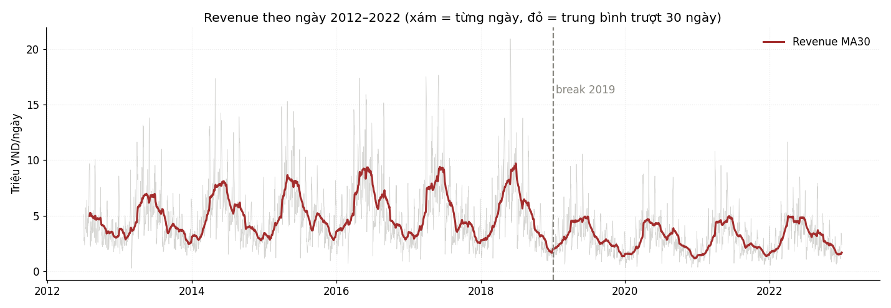
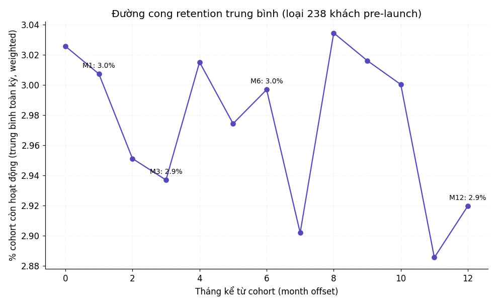

<!-- _class: lead -->
<!-- _paginate: false -->
<!-- _header: '' -->

# Từ 11 năm dữ liệu bán hàng đến dự báo 548 ngày

### Descriptive → Diagnostic → Dashboard → Prescriptive → **Forecast**

Nhóm: *(tên nhóm)* · 2026-07-28

Phần A (chuyện gì / vì sao / ai / làm gì) → Cầu nối → Phần B (model → validation → rủi ro)

---

## Tóm tắt 30 giây

- **A — Chuyện gì:** doanh thu **gãy cấu trúc 2019 (−38,6%)**, chưa hồi phục đỉnh cũ.
- **A — Vì sao:** **sụp khối lượng** (qty −40%, khách −28%), **KHÔNG phải giá** (ASP/AOV +2,4%/+2,7%).
- **A — Ai:** 25,6% khách (Champions) = 62,9% giá trị; **cohort retention phẳng ~3–6%** → data không có hành vi quay lại thật.
- **A — Làm gì:** floor price = giá vốn **+0,462 tỷ VND/10 năm**; **không giảm giá**.
- **🔗 Cầu nối:** cohort phẳng ⇒ feature hành vi vô nghĩa ⇒ B **chỉ dùng feature lịch**.
- **B — Kết quả:** LightGBM + ensemble → **Revenue WAPE 22,71% · COGS 19,79% — vượt mốc cả 2.**

---

<!-- _class: lead -->
# PHẦN A
## 4 câu hỏi điều tra

**1. Chuyện gì đã xảy ra?** (Descriptive)  ·  **2. Vì sao?** (Diagnostic)
**3. Ai tạo giá trị?** (Dashboard)  ·  **4. Nên làm gì?** (Prescriptive)

Mọi số truy nguồn Phase 1–4 · dữ liệu 2012–2022 · gross demand khớp `sales.csv`

---

## A1 — Doanh thu gãy cấu trúc năm 2019

| Năm | Doanh thu (tỷ) |
|---|---:|
| 2016 | 2,10 *(đỉnh)* |
| 2018 | 1,85 |
| **2019** | **1,14 (−38,6%)** |
| 2021 | 1,04 *(đáy)* |
| 2022 | 1,17 *(+12% hồi phục)* |

- CAGR 2013–22: **−3,80%/năm** doanh thu.
- Lợi nhuận gộp 2019–21 **−12%/năm ≈ gấp 3 lần** doanh thu → margin bị bào mòn.
- Tết **KHÔNG cố định** qua năm (dip mồng 1: −9,8% → −39,8%).

---

## A2 — Vì sao: sụp KHỐI LƯỢNG, không phải giá

| Chỉ số 2018→2019 | YoY |
|---|---:|
| Revenue | **−38,6%** |
| ASP (giá bán) | **+2,4%** |
| Số lượng (qty) | **−40,0%** |
| Khách active | **−28,0%** |

- Giảm giá kích cầu thì ASP↓ qty↑ — **thực tế ngược lại** ⇒ vấn đề **khối lượng/khách**.
- Đã loại: mix, promo, kênh (6 kênh rơi đều 37–41%), vùng.
- **Khuyến mãi** → 47,9% dòng có promo bán **dưới giá vốn** → **382 ngày lỗ gộp**.
- ⚠️ **Nguyên nhân gốc "vì sao khách rời" NẰM NGOÀI data giao dịch** — nói thẳng.

---

## A3 — Ai tạo giá trị + phát hiện then chốt

- **Pareto:** 25,6% khách (Champions) = **62,9% giá trị** (8,95 tỷ VND).
- **West** nhỏ nhất nhưng chất lượng khách tốt nhất (36,1% Champions).
- 🔴 **Cohort retention PHẲNG ~3–6%** mọi tháng (M1≈M12) — khách thật phải giảm dần.
- ⇒ **Data khách sinh ngẫu nhiên, không có hành vi quay lại thật.**

> Đây là phát hiện **quyết định toàn bộ Phần B**.

---

## A4 — Nên làm gì: 4 đề xuất định lượng

| # | Đề xuất | Tác động |
|---|---|---|
| **1** | **Floor price = giá vốn** | **+0,462 tỷ VND/10 năm** (+2,36pp) |
| 2 | Win-back CLT → At Risk | +2,9→24,9 tr VND (cần A/B test) |
| 3 | Nhân rộng pricing West | +38 tr/10 năm (bài học vận hành) |
| 4 | **KHÔNG giảm giá/tăng promo** | ưu tiên acquisition West + giữ Champions |

Nguyên tắc: vấn đề là khối lượng/khách — không giảm giá để "cứu" doanh thu.

---

<!-- _class: bridge -->
## 🔗 CẦU NỐI A → B — insight A quyết định model B

| Phát hiện A | ⇒ Quyết định B |
|---|---|
| **Cohort phẳng ~3–6%** | Bỏ feature hành vi → **chỉ feature thuần lịch** |
| Target khớp `sales.csv` (gap net 13,37%) | **Target = gross demand** (MAPE 0.000%) |
| **Tết không cố định** | biến liên tục **`days_from_tet`** (feature #2) |
| **Break 2019** (nền thấp hẳn) | `is_post_2019` + `trend_index`; **bỏ linear → cây** |
| Mùa vụ tháng ổn định | `month_sin/cos`; **loại `quarter`** (dư thừa) |
| Nguyên nhân gốc ngoài data | nêu thẳng **rủi ro sốc cấu trúc** |

> **Không lựa chọn nào của B là mặc định — tất cả lần ngược về 1 phát hiện định lượng của A.**

---

## B — Thiết kế: target đúng + đánh giá trung thực

- **Target = gross demand** (kể cả đơn huỷ) — khớp `sales.csv` **MAPE 0.000%**; net lệch 13,9%.
- Revenue & COGS **train độc lập** — không ép ràng buộc cứng.
- **17 feature thuần lịch** (tháng, tuần, `days_from_tet`, `is_post_2019`, `trend_index`).
- **Rolling-origin 5 fold**, tôn trọng thời gian — không dùng tương lai dự đoán quá khứ.
- Holdout chính `main_548d` (548 ngày) = đúng độ dài horizon thật.

⚠️ Mọi WAPE đến từ holdout nội bộ 2012–2022 — chưa có ground-truth 2023–24.

---

## B1 — Bất ngờ: baseline "ngây thơ" thắng

| Baseline | Rev WAPE | COGS WAPE |
|---|---:|---:|
| **B1 seasonal naive** | **25,18%** | **23,09%** |
| B3 linear (đủ feature) | 46,97% | 42,28% |

- Copy giá trị năm ngoái **thắng áp đảo** hồi quy tuyến tính (~25% vs ~47%).
- Linear 1 hệ số trend **không khớp break 2019** → bias **+29–39%**, ra **4 ngày doanh thu âm**.
- ⇒ chốt hướng: **giữ lag mùa vụ + model cây** (phi tuyến), chặn giá trị ≥ 0.

---

## B2 — Model cuối: LightGBM + Ensemble → VƯỢT MỐC

| Target | Mốc B1 | **Model cuối** | Cải thiện |
|---|---:|---:|---:|
| **Revenue WAPE** | 25,18% | **22,71%** | −9,8% rel |
| **COGS WAPE** | 23,09% | **19,79%** | −14,3% rel |

- Cuối cùng = **LightGBM global + ensemble 50/50 với B1**.
- Thêm feature `lag_365` (giá trị cùng kỳ năm trước) — đúng bài học baseline.
- Chia theo quý *tệ hơn*; `quarter` importance ~0.
- **Vượt mốc cả WAPE lẫn MAPE/RMSE/MAE.**

---

## B3 — Vì sao ensemble thắng (cơ chế, không may mắn)

- **LightGBM** học phi tuyến 10 năm nhưng **làm mượt** spike ngày lẻ.
- **B1** copy nguyên biến động 1 năm → bắt spike tốt, không học 9 năm còn lại.
- Trung bình 2 kiểu sai → triệt tiêu cả hai.

**Bằng chứng (đo tách đầu/đuôi horizon):**

| Target | Model | đầu 1–365 | đuôi 366–548 |
|---|---|---:|---:|
| Revenue | Ensemble | 23,83% | **20,09%** (đỡ hơn hẳn) |
| COGS | LightGBM đơn | 19,58% | 21,19% *(cộng dồn)* |
| COGS | **Ensemble** | 20,03% | **19,20%** (neo lại) |

---

## B4 — Validation: có tin được không?

QA **kiểm định độc lập** (không phải người xây model):

- ✅ Metric tính lại **khớp** (22,71% / 19,79%).
- ✅ **Không leakage** — 6/6 tiêu chí PASS (đọc code).
- ✅ **Tái lập byte-identical** (sha256 khớp 2 lần chạy).
- ✅ **SHAP giải thích được**: `lag_365`+, `trend_index`−, `days_from_tet`+ — khớp phát hiện A.
- **GATE: GO** (điều kiện CRLF đã gỡ → `forecast_548_SUBMIT_crlf.csv`).

---

## B5 — Ba rủi ro trung thực (không giấu)

1. **Chặn-trần `trend_index`** — 100% ngày forecast vượt phạm vi train → model **đứng yên**. Nếu 2023–24 **bật tăng vượt lịch sử → under-forecast**. Rủi ro **một chiều, thận trọng**.
2. **Chưa có ground-truth 2023–24** — WAPE chỉ từ holdout nội bộ; giả định cơ chế data không đổi (chưa kiểm chứng).
3. **Sốc cấu trúc kiểu 2019** → mọi model chịu chung (fold `rolling_2`: 44–63%). **Fallback: GradientBoosting** + kế hoạch giám sát.

47/548 ngày (8,6%) forecast COGS>Revenue — do train độc lập; margin gộp cả kỳ +13,48% ≈ lịch sử, khớp tỷ lệ ngày lỗ 9,97% quá khứ.

---

<!-- _class: lead -->
## Kết luận

**Một câu chuyện liền mạch:** cohort không có hành vi thật ⇒ dự báo **chỉ dùng lịch** trên **gross demand**, chọn **cây + ensemble** ⇒ **vượt mốc cả 2 target**, QA kiểm định độc lập.

**Business:** floor price = giá vốn **+0,462 tỷ VND/10 năm**; giữ khối lượng/khách, **không giảm giá**.

**Trung thực:** nguyên nhân gốc ngoài data · chưa có ground-truth · model thận trọng nếu cầu bật tăng.

### Revenue WAPE **22,71%** · COGS WAPE **19,79%** — bản nộp sẵn sàng ✅
