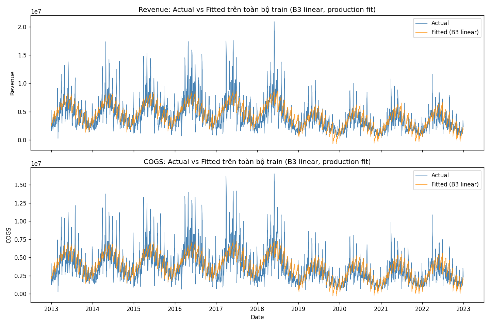
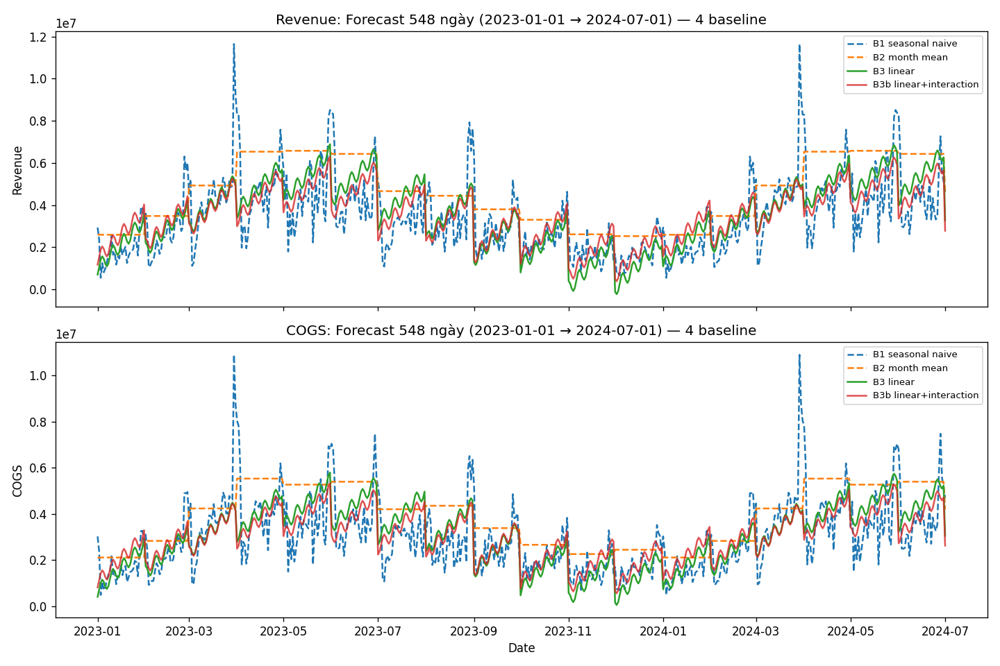

# Baseline Report — Giai đoạn 7 (ds)

- **Vai trò:** DS, xây baseline dự báo Revenue + COGS 548 ngày (2023-01-01 → 2024-07-01), độc lập.
- **Script tái lập:** `EDA_Insight/phase7_baseline/build_baselines.py` — chỉ đọc `EDA_Insight/phase6_features/data/features_train.csv` + `features_forecast.csv` + `data/sample_submission.csv` (đối chiếu format), ~vài giây, không sinh lại feature.
- **CHƯA có ground-truth 2023-2024** → mọi con số accuracy trong báo cáo này đến từ **holdout nội bộ trong dữ liệu train** (2012-2022), KHÔNG phải đánh giá trên horizon thật.
- Revenue và COGS train **độc lập** (đúng chốt Giai đoạn 5) — không dùng COGS để dự đoán Revenue hay ngược lại, không ràng buộc COGS < Revenue.

---

## 1. Thiết kế đánh giá

### 1.1 Holdout (chống leakage)

| Tập | Range | Số ngày | Vai trò |
|---|---|---:|---|
| `train_fit` | 2012-07-04 → 2021-07-01 | 3,285 | Fit model để backtest (KHÔNG thấy holdout) |
| **Holdout chính** | 2021-07-02 → 2022-12-31 | 548 | Mô phỏng đúng độ dài (548 ngày) + độ mới (ngay sau train_fit) của horizon thật |
| Holdout phụ | 2022-01-01 → 2022-12-31 | 365 | Subset của holdout chính, xem riêng năm gần nhất |

`train_fit` không chứa bất kỳ ngày nào của 2 holdout — mọi model (kể cả seasonal naive) chỉ được tra cứu giá trị trong `train_fit` khi backtest.

**Fit cho forecast thật (548 ngày 2023-2024):** dùng TOÀN BỘ `features_train.csv` (2012-2022, 3,833 ngày) — không phải leakage vì đây là forecast thật, không có ground-truth nào bị lộ.

### 1.2 Xử lý khuyến nghị Giai đoạn 6 (feature_spec.md mục 5)

| Khuyến nghị Giai đoạn 6 | Áp dụng ở Giai đoạn 7 |
|---|---|
| Bỏ `quarter` (dư thừa với `month`) | Không đưa `quarter` vào B3/B3b |
| Không đưa 3 cờ lễ VN + `dow_cos` vào baseline đầu | Không dùng `is_holiday_302_305`, `is_holiday_qk`, `is_christmas`, `dow_cos` ở B3/B3b (để Giai đoạn 8 test residual sau) |
| Đa cộng tuyến `trend_index`/`year`/`is_post_2019` | B3/B3b chỉ dùng `trend_index` (KHÔNG dùng `year`) + `is_post_2019` |
| `day_of_week` nên mã hoá cyclical cho linear model | Dùng `dow_sin`, không dùng `day_of_week` số nguyên thô |
| Cân nhắc loại 2012 (nửa năm) cho model có year/trend | **Xem quyết định cụ thể dưới** |

**Feature dùng cho B3 (9 cột, đúng thứ tự ưu tiên feature_spec mục 5):** `month_sin`, `month_cos`, `dow_sin`, `days_from_tet`, `is_post_2019`, `is_post_2019_transition`, `is_low_margin_season`, `trend_index`, `day_of_month`.

**B3b** = B3 + 2 cột interaction `is_post_2019 × month_sin`, `is_post_2019 × month_cos` (theo gợi ý G1 — biên độ mùa vụ có thể đổi khác sau break).

### 1.3 Quyết định 2012 (`is_partial_year_2012`)

**KHÔNG đồng nhất — quyết định khác nhau theo loại model:**

- **B1 (seasonal naive) và B2 (month-mean): GIỮ 181 ngày 2012.** 2 baseline này không dùng `year`/`trend_index`, chỉ dùng vị trí lịch (ngày cùng kỳ năm trước, hoặc trung bình theo tháng) — 2012 chỉ góp thêm quan sát cho các tháng 7-12 (đã có ở mọi năm khác), không gây lệch.
- **B3/B3b (linear, có `trend_index`): LOẠI 181 ngày 2012** khỏi tập fit (`train_fit`: 3,285 → 3,104 ngày; `train_full` production: 3,833 → 3,652 ngày). Lý do (đã nêu ở `feature_spec.md` mục 5): 2012 chỉ có nửa cuối năm (thiếu hoàn toàn T1-T6, đúng giai đoạn đỉnh doanh thu) → Revenue trung bình 2012 (4.10 triệu/ngày) thấp bất thường so với các năm pre-break khác (4.54-5.75 triệu) không phải vì 2012 yếu thật mà vì thiếu dữ liệu — nếu giữ sẽ kéo lệch hệ số `trend_index`.

---

## 2. Baseline

| Tên | Công thức | Ghi chú |
|---|---|---|
| **B1 — Seasonal naive** | ŷ(t) = giá trị tại (t − 365 ngày). Nếu thiếu đúng ngày lag (hiếm, biên dữ liệu), tìm ngày gần nhất trong ±3 ngày, cuối cùng mới dùng trung bình toàn lịch sử. | Khi horizon dài hơn 365 ngày (548 > 365), các ngày xa (từ ngày thứ 366 trong horizon) phải tham chiếu tới **giá trị đã dự đoán trước đó của chính baseline** (không phải actual) — chain dự đoán, không phải leakage, nhưng làm giảm độ tin cậy phần đuôi horizon (nêu ở mục 5 hạn chế). |
| **B2 — Month-mean** | ŷ(t) = trung bình target theo `month` của ngày t, tính trên tập fit. | Nắm mùa vụ nhưng KHÔNG có trend/break — dự đoán y hệt nhau mọi năm cùng tháng. |
| **B3 — Linear (OLS)** | Hồi quy tuyến tính `sklearn.LinearRegression` trên 9 feature mục 1.2. | Baseline "dùng feature" chính — mốc để Giai đoạn 8 phải vượt qua. |
| **B3b — Linear + interaction** | B3 + `is_post_2019×month_sin`, `is_post_2019×month_cos`. | Test gợi ý G1 (biên độ mùa vụ đổi sau break). |

---

## 3. Kết quả — bảng metric

### 3.1 Holdout chính (548 ngày, 2021-07-02 → 2022-12-31)

| Baseline | Target | MAPE% | WAPE% | RMSE | MAE |
|---|---|---:|---:|---:|---:|
| **B1 seasonal naive** | Revenue | **27.48** | **25.18** | 1,022,856 | 724,009 |
| B2 month-mean | Revenue | 78.68 | 56.51 | 1,899,771 | 1,624,688 |
| B3 linear | Revenue | 56.93 | 46.97 | 1,650,678 | 1,350,529 |
| B3b linear+interaction | Revenue | 59.73 | 46.54 | 1,590,459 | 1,338,230 |
| **B1 seasonal naive** | COGS | **24.08** | **23.09** | 830,134 | 601,980 |
| B2 month-mean | COGS | 70.80 | 52.22 | 1,591,632 | 1,361,207 |
| B3 linear | COGS | 50.46 | 42.28 | 1,389,627 | 1,102,071 |
| B3b linear+interaction | COGS | 52.16 | 41.22 | 1,332,934 | 1,074,511 |

### 3.2 Holdout phụ (365 ngày, cả năm 2022)

| Baseline | Target | MAPE% | WAPE% | RMSE | MAE |
|---|---|---:|---:|---:|---:|
| **B1 seasonal naive** | Revenue | **24.39** | **22.67** | 990,174 | 726,380 |
| B2 month-mean | Revenue | 68.70 | 50.08 | 1,915,042 | 1,605,006 |
| B3 linear | Revenue | 60.51 | 48.27 | 1,838,393 | 1,547,092 |
| B3b linear+interaction | Revenue | 69.20 | 50.24 | 1,811,366 | 1,610,077 |
| **B1 seasonal naive** | COGS | **24.75** | **23.15** | 867,746 | 647,104 |
| B2 month-mean | COGS | 66.52 | 49.07 | 1,638,987 | 1,371,712 |
| B3 linear | COGS | 55.89 | 44.78 | 1,537,730 | 1,251,887 |
| B3b linear+interaction | COGS | 62.67 | 45.93 | 1,505,236 | 1,284,056 |

**Không có ngày y≈0** trong bất kỳ target/holdout nào (`n_zero_actual = 0` toàn bộ) → MAPE tính được ổn định, không bùng nổ, tin cậy song song với WAPE.

**Đọc kết quả — bất ngờ quan trọng:** **B1 (seasonal naive) THẮNG cả B2 và B3/B3b trên MỌI metric, MỌI target, MỌI holdout.** Đây KHÔNG phải lỗi tính toán (đã kiểm tra lại bias — xem mục 4.4) mà là phát hiện thật, cần Giai đoạn 8 lưu ý nghiêm túc.

---

## 4. Biểu đồ + phân tích

### 4.1 Actual vs Fitted trên toàn bộ train (B3 linear, production fit)

1. **Thể hiện gì:** 2 panel (Revenue, COGS) — đường xanh là giá trị thật `sales.csv` 2013-2022 (bỏ 2012 theo quyết định mục 1.3), đường cam là giá trị B3 linear dự đoán trên chính tập nó được fit (production fit, dùng toàn bộ train_full_b3).
2. **Insight:** đường cam bắt được hình dạng mùa vụ (đỉnh giữa năm, đáy cuối năm) và mức nền thấp hơn rõ rệt sau 2019 — xác nhận `month_sin/cos` + `is_post_2019` hoạt động đúng hướng. Nhưng đường cam mượt hơn nhiều so với đường xanh (không bắt được các đỉnh nhọn/spike ngày lẻ, ví dụ đỉnh >2×10⁷ đầu 2018) — linear model chỉ giải thích được phần "trung bình có điều kiện", bỏ sót biến động ngày-qua-ngày.
3. **Lưu ý khi đọc:** một số đoạn đường cam đi xuống dưới 0 (rõ nhất quanh 2019-2022, COGS) — dấu hiệu linear model không có ràng buộc không-âm, sẽ ảnh hưởng tới cả forecast (xem mục 4.3 và 4.4). Không nên đọc biểu đồ này như "model tốt" chỉ vì bám sát trend chung — phải nhìn cùng bảng metric mục 3 (R² cao trên train KHÔNG đồng nghĩa dự báo tốt trên dữ liệu chưa thấy).

### 4.2 Actual vs Predicted trên holdout chính (548 ngày)

1. **Thể hiện gì:** đường đen là Actual (holdout 2021-07-02 → 2022-12-31), 4 đường màu là 4 baseline dự đoán cùng khoảng thời gian, 2 panel Revenue/COGS.
2. **Insight:** đường B1 (nét đứt xanh dương, "seasonal naive") bám sát biến động lên-xuống của Actual tốt hơn hẳn — kể cả spike đột biến giữa 2022 (đường đen vọt lên >1×10⁷) B1 cũng nhô lên theo (vì nó lấy đúng giá trị năm trước tại vị trí tương ứng, và nếu năm trước cũng có spike mùa vụ tương tự thì bắt được). B2 (nét đứt cam) là đường bậc thang phẳng theo tháng, hoàn toàn không phản ứng với xu hướng phục hồi 2022 — sai nhiều nhất. B3/B3b (xanh lá, đỏ) nằm cao hơn Actual khá rõ trong phần lớn giai đoạn, đặc biệt rõ ở nửa sau 2022 — xác nhận linear model bị lệch (bias) hướng lên.
3. **Lưu ý khi đọc:** trục ngày dày đặc (548 điểm) nên nhãn ngày ở trục x không đọc được từng điểm — chỉ nên đọc xu hướng tổng thể (đường nào bám actual, đường nào lệch hệ thống), không cố đọc giá trị chính xác 1 ngày cụ thể từ chart này (dùng `data/holdout_predictions.csv` nếu cần số chính xác).

### 4.3 Forecast 548 ngày, 4 baseline chồng nhau

1. **Thể hiện gì:** dự báo thật 2023-01-01 → 2024-07-01 (không có actual để so sánh) của cả 4 baseline, 2 panel Revenue/COGS.
2. **Insight:** hình dạng mùa vụ lặp lại rõ ràng ở cả 4 baseline (đỉnh giữa mỗi năm dương lịch, đáy cuối năm khớp `is_low_margin_season`). B1 dao động biên độ rộng nhất (giữ nguyên độ nhiễu ngày-qua-ngày của năm gốc dùng làm lag), B2 là các bậc thang phẳng theo tháng (không có biến động ngày), B3/B3b mượt nhưng có xu hướng nhỉnh cao hơn B1 ở phần lớn thời gian — nhất quán với bias đã thấy ở holdout (mục 4.2).
3. **Lưu ý khi đọc:** đường B3 (xanh lá) có 4 ngày dự đoán **Revenue ÂM** (thấp nhất -231,484 VND, ngày 2023-12-02) — nhìn trên chart khó thấy rõ vì chỉ vài điểm chạm/xuống dưới 0 ở vùng cuối năm 2023, nhưng đây là lỗi cấu trúc thật của linear regression (không có ràng buộc không-âm), đã liệt kê đầy đủ trong `data/metrics_summary.csv`/dữ liệu forecast — **không dùng B3 làm submission cuối nếu không xử lý floor tại 0**. B3b (đỏ) không có ngày nào âm nhờ interaction term điều chỉnh biên độ mùa vụ theo giai đoạn.

### 4.4 Residual của B3 trên holdout chính

1. **Thể hiện gì:** `actual − predicted` (B3 linear) theo ngày, holdout chính, đường 0 là mốc tham chiếu — 2 panel Revenue/COGS.
2. **Insight:** residual **lệch âm mang tính hệ thống** (đa số điểm nằm dưới 0), đặc biệt rõ ở nửa sau giai đoạn — nghĩa là actual < predicted đa số ngày, khớp con số mục kiểm tra bias: Revenue actual trung bình holdout chính = 2,875,239 nhưng B3 dự đoán trung bình 3,712,559 (lệch +29%); riêng năm 2022, actual trung bình 3,204,791 nhưng B3 dự đoán 4,461,063 (lệch +39%). **Nguyên nhân xác định được:** `trend_index` là 1 hệ số tuyến tính DUY NHẤT ước lượng trên toàn bộ 2013-2022 (bỏ 2012) — hệ số này là compromise giữa xu hướng TĂNG mạnh 2013-2018 và xu hướng GIẢM/phục hồi chậm 2019-2022, nên khi ngoại suy (extrapolate) tới 2021-2022 và xa hơn nữa (2023-2024), nó vẫn cộng thêm độ dốc dương của giai đoạn tăng trưởng cũ, dẫn tới dự đoán cao hơn thực tế một cách hệ thống.
3. **Lưu ý khi đọc:** residual không phân bố ngẫu nhiên quanh 0 (có pattern rõ theo thời gian) — đây là dấu hiệu **model chưa đủ (underfit theo trend cấu trúc)**, không phải nhiễu đo lường. Không nên dùng RMSE/MAE của B3 như thước đo "sai số ngẫu nhiên" thông thường; bias hệ thống này còn nguy hiểm hơn cho horizon 2023-2024 thật vì càng xa mốc train_full (`trend_index` càng lớn), sai lệch ngoại suy càng có khả năng tích luỹ thêm (xem khuyến nghị mục 5).

### 4.5 So sánh MAPE/WAPE giữa 4 baseline

1. **Thể hiện gì:** 4 panel (Revenue×MAPE, Revenue×WAPE, COGS×MAPE, COGS×WAPE), mỗi panel 4 cột ứng 4 baseline, số ghi trên đầu cột, tất cả tính trên holdout chính.
2. **Insight:** thứ tự nhất quán ở cả 4 panel: **B1 thấp nhất (tốt nhất) → B3b ≈ B3 → B2 cao nhất (tệ nhất)**. Khoảng cách B1 so với B3/B3b rất lớn (WAPE Revenue: 25.2% vs ~47%, gần gấp đôi), không phải chênh lệch nhỏ trong biên sai số ngẫu nhiên.
3. **Lưu ý khi đọc:** MAPE luôn cao hơn WAPE ở cả 4 baseline (đúng tính chất toán học — MAPE nhạy với ngày actual nhỏ, WAPE cân bằng theo tổng biên độ) → **nên dùng WAPE làm chỉ số chính để so sánh baseline** (khuyến nghị nêu ở đề bài), MAPE chỉ để tham khảo thêm. B2 (month-mean) tệ nhất không có nghĩa "mùa vụ vô dụng" — mà vì B2 hoàn toàn bỏ qua trend/break, chỉ dùng trung bình lịch sử toàn giai đoạn (bao gồm cả các năm doanh thu cao trước break) nên bị lệch nặng lên trên so với mức nền thấp hơn sau 2019.

---

## 5. Chọn mốc cho Giai đoạn 8 + khuyến nghị

### 5.1 Mốc phải vượt

**Baseline tốt nhất: B1 — Seasonal naive** (chọn theo avg WAPE Revenue+COGS, holdout chính):

| | Revenue | COGS |
|---|---:|---:|
| MAPE (holdout chính, 548 ngày) | **27.48%** | **24.08%** |
| WAPE (holdout chính, 548 ngày) | **25.18%** | **23.09%** |
| MAPE (holdout phụ, 2022) | 24.39% | 24.75% |
| WAPE (holdout phụ, 2022) | 22.67% | 23.15% |

→ **Giai đoạn 8 (ensemble/tree-based) phải đạt WAPE thấp hơn 25.18% (Revenue) và 23.09% (COGS) trên holdout chính mới coi là có giá trị thêm** so với model đơn giản nhất có thể (không dùng feature nào ngoài lấy lại giá trị năm trước). Nếu ensemble không vượt được B1, nghĩa là feature engineering/model phức tạp chưa mang lại giá trị thật, không nên ship.

File format sẵn cho Giai đoạn 9: `data/submission_best_baseline.csv` (đúng cột `Date,Revenue,COGS` như `sample_submission.csv`, nội dung = forecast B1 seasonal naive, production fit dùng toàn bộ train 2012-2022).

### 5.2 Khuyến nghị cho Giai đoạn 8

1. **Model tree-based (Random Forest / Gradient Boosting) có khả năng cao vượt B1** — lý do: tree không ngoại suy 1 trend tuyến tính xuyên suốt break (nguyên nhân chính B3 thua ở mục 4.4), mà học các "vùng" (leaf) riêng biệt theo `is_post_2019`, `month`, `days_from_tet` — vừa giữ được tín hiệu mùa vụ/Tết từ 10 năm dữ liệu (không như B1 chỉ nhìn 1 năm), vừa không bị bias ngoại suy tuyến tính như B3. Đây là hướng thử nghiệm ưu tiên số 1.
2. **Thêm feature "giá trị cùng kỳ năm trước" (`lag_365`) làm input cho ensemble**, thay vì chỉ dùng nó như 1 baseline độc lập — B1 thắng áp đảo chứng tỏ thông tin "giá trị năm ngoái cùng ngày" rất mạnh, ensemble nên tận dụng trực tiếp làm feature (không chỉ dùng feature lịch thuần suy ra từ ngày tháng).
3. **Xử lý break 2019 kỹ hơn dummy đơn giản:** B3b (có interaction `is_post_2019×month`) chỉ nhỉnh hơn B3 rất ít (WAPE COGS 41.2% vs 42.3%, Revenue gần như bằng nhau) — dummy/interaction ở dạng linear KHÔNG đủ để sửa bias ngoại suy trend. Giai đoạn 8 nên thử: (a) tree-based tự học phi tuyến, hoặc (b) nếu vẫn dùng linear, cân nhắc bỏ hẳn `trend_index` toàn cục, thay bằng trend cục bộ/piecewise theo từng giai đoạn (trước/sau 2019), hoặc trọng số cao hơn cho quan sát gần (đã gợi ý ở `model_assumptions.md` G1).
4. **Rủi ro break 2019 quanh horizon dự báo thật (2023-2024):** 2022 là năm phục hồi đầu tiên (+12.15% YoY theo Giai đoạn 5) nhưng vẫn thấp hơn nhiều so với 2013-2018 — nếu Giai đoạn 8 dùng model học được xu hướng "đang phục hồi", cần kiểm tra kỹ có ngoại suy quá đà (giả định phục hồi về lại mức 2013-2018) hay không, vì KHÔNG có bằng chứng nào trong dữ liệu 2012-2022 xác nhận tốc độ phục hồi này duy trì tới 2023-2024 — nên theo dõi sát bằng backtest trên chính holdout 548 ngày này trước khi tin forecast production.
5. **Loại bỏ hoàn toàn dự đoán ÂM khỏi mọi baseline/model dùng ở Giai đoạn 8+** — B3 linear đã cho 4 ngày Revenue âm trong forecast (mục 4.3); bất kỳ linear/ensemble nào cũng cần áp `floor tại 0` (hoặc log-transform target) trước khi submit, vì Revenue/COGS âm không có ý nghĩa vật lý.
6. **Vẫn cần thêm `day_of_month` và interaction post_2019 vào ensemble** dù chưa có bằng chứng cải thiện rõ ở baseline linear — vì tree-based có thể khai thác các feature này khác hẳn (phi tuyến, tương tác tự động) so với linear, không nên loại bỏ sớm chỉ vì linear model chưa cho thấy giá trị.

---

## 6. Hạn chế & rủi ro

1. **B1 seasonal naive thắng không có nghĩa "không cần model"** — nó chỉ chứng minh linear model đơn giản (B3/B3b) hiện tại CHƯA đủ tốt để thay thế naive, không phải kết luận "không nên đầu tư ensemble". Ngược lại, khoảng cách lớn (WAPE ~25% vs ~47%) cho thấy CÒN NHIỀU DƯ ĐỊA cải thiện nếu Giai đoạn 8 xử lý đúng vấn đề bias ngoại suy đã chỉ ra ở mục 4.4.
2. **B1 dùng chain dự đoán cho phần horizon > 365 ngày** (cả ở holdout 548 ngày lẫn forecast 548 ngày thật) — với holdout, ~183 ngày cuối (từ khoảng giữa 2022) tham chiếu tới **giá trị dự đoán** của chính B1 ở phần đầu holdout (không phải actual), nên phần thắng của B1 có thể bị đánh giá hơi lạc quan ở đúng đoạn cuối — đã thấy dấu hiệu này rõ ở chart 4.2 (B1 vẫn bám khá sát dù đã chain, nhưng không hoàn hảo bằng đoạn đầu holdout dùng actual trực tiếp).
3. **Toàn bộ đánh giá dựa trên 1 lần chia holdout duy nhất** (không phải cross-validation nhiều fold theo thời gian) — do ràng buộc thời gian của baseline giai đoạn này; Giai đoạn 8 nên cân nhắc rolling-origin backtest (nhiều điểm cắt) nếu cần kết luận chắc chắn hơn về baseline nào ổn định nhất.
4. **`is_post_2019_transition` không có ý nghĩa thống kê rõ trong B3** (p-value 0.64 Revenue, 0.45 COGS — xem `data/b3_ols_coefficients.csv`) — không phải bằng chứng nó vô dụng cho ensemble (linear có thể không khai thác đúng cách), nhưng cũng không phải bằng chứng nó hữu ích — cần Giai đoạn 8 tự đánh giá lại bằng feature importance của model mới.
5. **File `data/b3_ols_coefficients.csv`** (coefficient + p-value từng feature B3, production fit) sinh thêm để tham khảo — KHÔNG phải yêu cầu bắt buộc của đề bài Giai đoạn 7, chỉ hỗ trợ diễn giải mục 4.4.

---

## 7. Danh sách file output

- `build_baselines.py` — script tái lập.
- `data/metrics_summary.csv` — bảng đầy đủ 4 baseline × 2 target × 2 holdout × 5 metric.
- `data/holdout_predictions.csv` — actual + dự đoán từng ngày, 4 baseline, holdout chính (có cờ `in_2022`).
- `data/forecast_B1_seasonal_naive.csv`, `forecast_B2_month_mean.csv`, `forecast_B3_linear.csv`, `forecast_B3b_linear_interaction.csv` — forecast 548 ngày mỗi baseline.
- `data/submission_best_baseline.csv` — forecast B1 (baseline tốt nhất), đúng format `Date,Revenue,COGS`.
- `data/b3_ols_coefficients.csv` — coefficient/p-value B3 (production fit), phụ trợ diễn giải.
- `data/best_baseline_name.txt` — tên baseline được chọn (`B1_seasonal_naive`).
- `EDA_Insight/output/phase7/07_*.png` — 5 biểu đồ, mỗi cái có phân tích ở mục 4.
